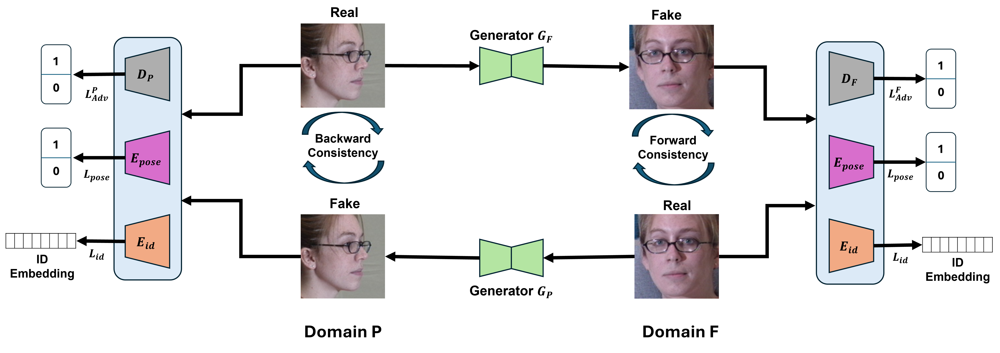

# PoseDefCycleGAN
**Identity-Preserving Face Frontalization with Deformable Convolutions and Pose-Aware Supervision**

## Overview
PoseDefCycleGAN is a deep learning framework for **face frontalization** that preserves **identity consistency** even under large pose variations.  
Our model integrates **deformable convolutions** and **pose-aware supervision** into a CycleGAN-based architecture, enabling accurate and natural frontal face synthesis.

This repository accompanies the paper:

> **PoseDefCycleGAN: Identity-Preserving Face Frontalization with Deformable Convolutions and Pose-Aware Supervision**  

## Architecture
Below is the overall architecture of **PoseDefCycleGAN**,.

  

> **Figure:** Overview of the PoseDefCycleGAN architecture. The network extends CycleGAN with deformable convolution modules and a pose-guided identity supervision branch to enhance face frontalization robustness.

## Code Availability
We appreciate the community’s interest in reproducibility and open research.

The **full implementation**, including:
- Training and inference scripts  
- Pre-trained model weights  
- Evaluation tools and dataset preparation guidelines  

will be **made publicly available soon** upon final acceptance of the paper.

## Repository Structure
PoseDefCycleGAN/
│
├── configs/
├── data/
├── models/
├── losses/
├── scripts/
├── weights/
├── utils/
├── docs/
└── README.md

## Key Features
- **Deformable Convolutions** for flexible feature alignment  
- **Pose-Aware Supervision** to improve identity retention  
- **CycleGAN Backbone** for unpaired image translation  
- **Robust Face Frontalization** across large pose ranges

## Results
Coming soon - visual comparisons and benchmark evaluations will be added upon public release.

