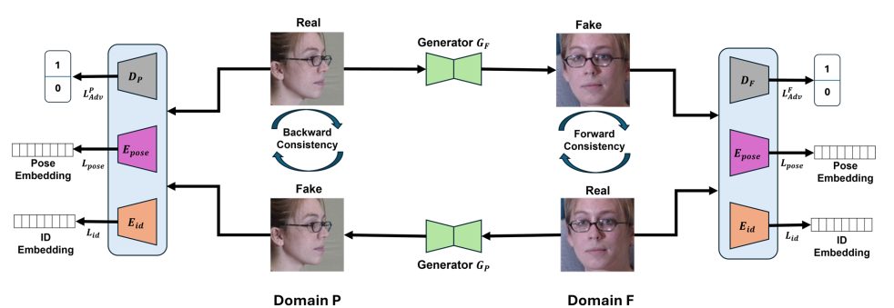
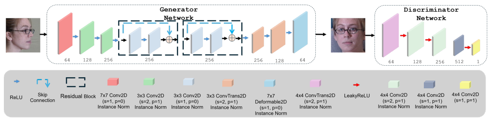
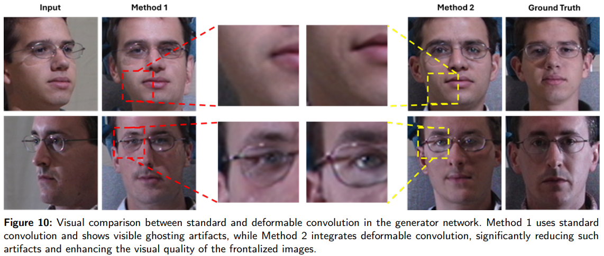
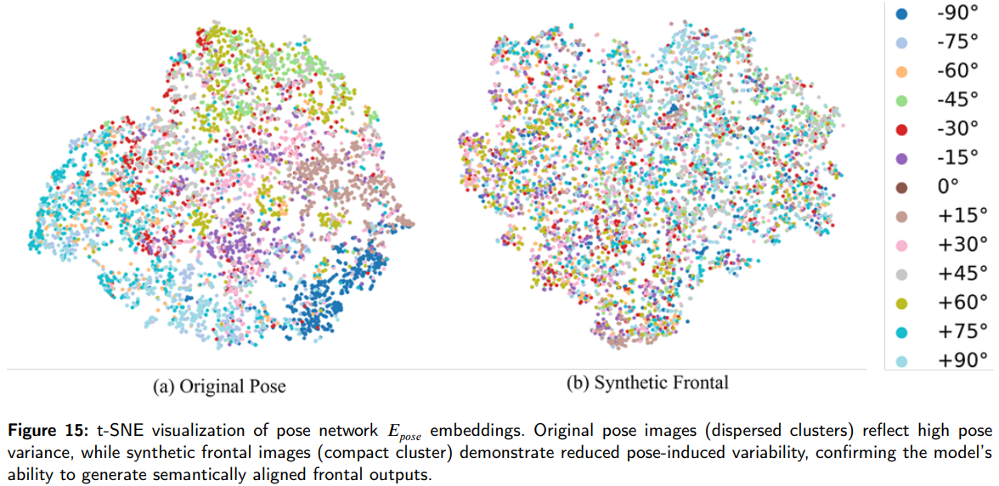
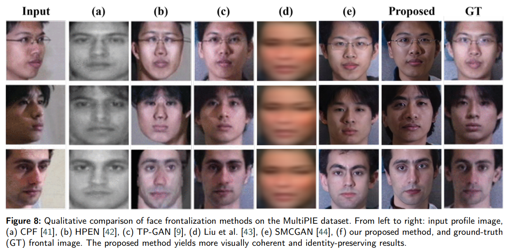
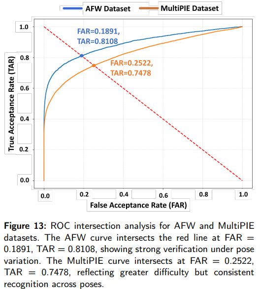

# PoseDefCycleGAN

**Identity-Preserving Face Frontalization with Deformable Convolutions and Pose-Aware Supervision**

This repository accompanies the paper *PoseDefCycleGAN: Identity-Preserving Face Frontalization with Deformable Convolutions and Pose-Aware Supervision*.

## Overview

Face recognition pipelines do well on near-frontal faces and lose accuracy fast under large yaw. Two things change between a profile shot and a frontal shot: the global geometry (where the eyes, nose, and mouth sit) and the local texture (occluded ear, foreshortened cheek, lens distortion on glasses). A plain CycleGAN handles the texture but smears the geometry, which is why frontalised outputs often drift in identity.

PoseDefCycleGAN tackles both. Cycle-consistent translation maps profile to frontal and back, a deformable convolution in the output layer of each generator adapts the sampling grid to the non-rigid pose warp, and two pretrained auxiliary networks supervise identity and pose alongside the standard adversarial loss.

Headline results: FID drops to 15.90 on MultiPIE (vs 18.32 for vanilla CycleGAN), rank-1 accuracy at the hardest yaw of plus or minus 90 degrees reaches 98.9% on MultiPIE, and LFW comes in at 90.20% accuracy with LPIPS = 0.3052.

## Framework



Two generators form the cycle. G_F maps a profile image I_p to a synthesised frontal `Î_f = G_F(I_p)`, and G_P maps a frontal back to a profile. Cycle consistency enforces that the round trip recovers the input.

Four critics act on the outputs:

* **D_F, D_P**: standard PatchGAN discriminators on the frontal and profile domains, providing the adversarial signal.
* **E_id**: a pretrained face recognition encoder, frozen during training. Drives the identity-preservation loss.
* **E_pose**: a pretrained deformable MobileNetV2 pose classifier from our earlier work [Ibrahim et al., 2025](https://doi.org/10.1109/ACCESS.2025.3541546), frozen during training. Drives the pose regularisation loss.

E_id and E_pose are separate frozen networks, not heads of the discriminator. Keeping them frozen means the identity and pose signals come from fixed, well-calibrated feature spaces instead of co-adapting with the GAN.

## Network architecture



**Generator** (top row, ReLU activations):

| Stage | Operation | Notes |
|---|---|---|
| Stem | 7x7 Conv2D (s=1, p=0), InstanceNorm, ReLU | Initial feature lift |
| Downsample x2 | 3x3 Conv2D (s=2, p=1), InstanceNorm, ReLU | Halves spatial size each time |
| Bottleneck | Two residual blocks (3x3 Conv2D pairs, skip connections) | Identity refinement |
| Upsample x2 | 3x3 ConvTrans2D (s=2, p=1), InstanceNorm, ReLU | Restores resolution |
| Output | 7x7 Deformable Conv2D (s=1, p=0), InstanceNorm | Only the final conv is deformable |

The deformable layer is intentionally limited to the last conv. Deformable convolutions are sensitive to hyperparameters and prone to overfitting on small face datasets, so confining them to the output layer keeps the bulk of the generator stable while still giving the final mapping the flexibility to handle non-rigid pose warps.

**Discriminator** (bottom row, LeakyReLU activations): a PatchGAN built from 4x4 Conv2D blocks (s=2 then s=1, InstanceNorm), with a final 4x4 Conv2D (s=1, p=1) producing the patch-level real/fake map.

## Why deformable convolution

A standard convolution samples on a fixed grid. The transformation from profile to frontal is not a grid: a 30 degree yaw moves the far eye, foreshortens the nose ridge, and changes how the temple of the glasses crosses the cheek. A deformable conv learns a per-location offset and modulation scalar, so the kernel reaches the pixels it actually needs.

The ablation below puts a generator with the deformable output layer (yellow boxes, right) next to the same generator with a standard conv output (red boxes, left). The mouth corners, the eyeglass frames, and the inner-eye region are visibly sharper on the deformable side.



## Loss function

The total objective combines four terms:

```
L_total = L_adv + λ1 · L_cyc + λ2 · L_id + λ3 · L_pose
```

with `λ1 = 10`, `λ2 = 0.001`, `λ3 = 0.001`.

* **Adversarial loss `L_adv`**: standard LSGAN-style real vs fake on D_F and D_P, summed across both directions of the cycle.
* **Cycle consistency `L_cyc`**: L1 reconstruction error between `G_P(G_F(I_p))` and `I_p`, plus the analogous frontal round trip.
* **Identity preservation `L_id`**: L1 distance between `E_id(input)` and `E_id(generated)` embeddings, in both directions of the cycle.
* **Pose regularisation `L_pose`**: four sub-terms using the pretrained pose encoder. Two are attraction terms that pull the generated image's pose embedding toward the target domain. Two are repulsion terms (negative sign) that push the generated pose embedding away from the source pose, which discourages pose leakage from the input. Computed with MAE.

The pose loss is the bit that makes this more than a CycleGAN with a fancy output layer. Without the repulsion terms, the generator can satisfy the adversarial and cycle losses while still leaving residual yaw in the synthesised frontal.

## Pose-invariant identity features

A t-SNE of the identity encoder E_id, coloured by yaw angle from -90 to +90 degrees:



Left is the raw pixel embedding. Colours cluster, which means pose dominates the representation. Right is the E_id embedding on generated frontals. Colours are scrambled, which means pose has been factored out and identity is what is left.

## Qualitative results on MultiPIE

Profile inputs on the left, several baselines in the middle columns, PoseDefCycleGAN and ground-truth frontal on the right.



## Quantitative results

Face verification ROC at the EER operating points:



| Dataset | FAR | TAR |
|---|---|---|
| AFW (from 300W-LP) | 0.1891 | 0.8108 |
| MultiPIE | 0.2522 | 0.7478 |

AFW comes out ahead because the 300W-LP augmented version mixes synthetic large poses with real-world appearance, while MultiPIE's protocol covers the full plus or minus 90 degree sweep in controlled lighting. The MultiPIE number is the more honest stress test.

## Datasets

| Dataset | Role | Protocol |
|---|---|---|
| CMU MultiPIE | Train + test | Setting-1 from Hu et al. 2018. First 150 identities of Session 1 for training across 13 poses including frontal. 99 held-out identities for testing with one neutral frontal as gallery. |
| LFW | Eval only | Unconstrained frontalization eval (occlusions, lighting, clutter). |
| AFW (from 300W-LP) | Eval only | 337 subjects with 3DMM-augmented synthetic poses up to plus or minus 90 degrees. |

Access each dataset through its official request form. None are redistributed in this repo.

## Preprocessing

* Resize to 256 x 256, normalise to `[-1, 1]`.
* Augmentations during training: random horizontal flip, rotation, random erasing. The pose classifier that supplies E_pose was trained with these same augmentations so that pose supervision stays robust to small geometric perturbations.


## Code availability

Full training and inference code, pretrained weights, and dataset preparation scripts will be released soon.

## Citation

```bibtex
@article{posedefcyclegan,
  title  = {PoseDefCycleGAN: Identity-Preserving Face Frontalization with Deformable Convolutions and Pose-Aware Supervision},
  author = {<authors>},
  year   = {<year>},
  note   = {Under review}
}
```

The pose encoder builds on:

```bibtex
@article{ibrahim2025improving,
  title   = {Improving Face Presentation Attack Detection Through Deformable Convolution and Transfer Learning},
  author  = {Ibrahim, Shakeel Muhammad and Ibrahim, Muhammad Sohail and Khan, Shujaat and Ko, Young-Woong and Lee, Jeong-Gun},
  journal = {IEEE Access},
  volume  = {13},
  pages   = {31228--31238},
  year    = {2025},
  doi     = {10.1109/ACCESS.2025.3541546}
}
```

## Licence and attribution

Figures in this README are taken from the paper above. Face crops shown in the figures originate from the CMU MultiPIE dataset (training, qualitative comparison, framework illustrations) and the AFW portion of 300W-LP (evaluation), and remain subject to those datasets' own terms of use.
